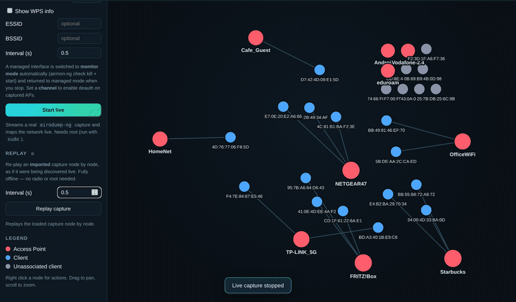
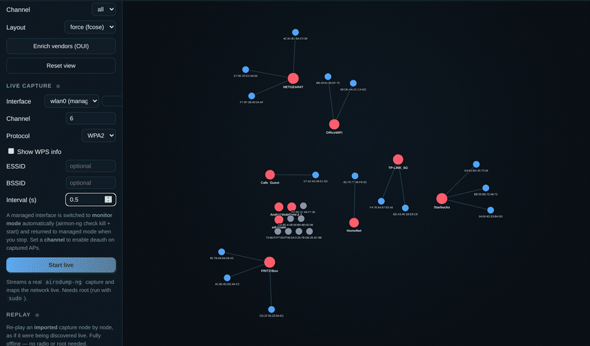

<div align="center">
  
</div>

WiFiHound turns `airodump-ng` output into an explorable graph of access points,
clients and their associations. Import a past scan and replay it, or run a live
capture and watch the map build in real time.

## Features

* Graph UI with access points in red, clients in blue, associations as edges.
* Search and filters by type, encryption and channel.
* Offline vendor lookup from the OUI database.
* Two ways to build the map: replay an imported capture, or live capture a real
  `airodump-ng` stream.
* WPA2-Enterprise: flag 802.1X APs, inspect and export the RADIUS certificate
  (`.txt` / PNG), and enumerate the EAP methods a network accepts.

## Install

WiFiHound needs Python 3.8 or newer, so use `python3` and `pip3` (a bare `pip`
on an old system can still point at Python 2).

```bash
git clone https://github.com/0xPR3ST1JH0NN7/WiFiHound
cd WiFiHound
python3 -m venv .venv
source .venv/bin/activate
pip install -r requirements.txt
```

WiFiHound also needs a few command-line tools on your `PATH`. On startup it
prints a dependency checklist and **refuses to start if a required tool is
missing**:

| Tool | Used for | Required |
| --- | --- | --- |
| `aircrack-ng`, `airmon-ng`, `airodump-ng`, `aireplay-ng` | the aircrack-ng suite (live capture, monitor mode, deauth) | ✅ |
| `tshark` | handshake detection + RADIUS certificate extraction | ✅ |
| `EAP_buster.sh` | EAP method enumeration (path via `WIFIHOUND_EAP_BUSTER`) | optional |

```bash
sudo apt install aircrack-ng tshark
```

Pass `--skip-checks` to bypass the gate for offline-only use (importing and
replaying captures needs no external tools).

## Run

```bash
python3 -m WiFiHound        # opens http://127.0.0.1:8000
sudo python3 -m WiFiHound   # also enables live radio capture
```

To stop the server, press **Enter** (or Ctrl+C) in the terminal where it runs.
NetworkManager is restarted automatically on exit, so normal Wi-Fi resumes after
a live capture.

Click **Import capture** and pick an `airodump-ng` CSV
(`airodump-ng -w scan --output-format csv wlan0mon`).

Without `sudo` the app runs in offline mode (import, replay and RADIUS
certificate upload); the **Live capture** panel is hidden, since live radio
capture and deauth need root. Start with `sudo` to unlock them.

## Replay

Importing a capture gives you the full graph of a past scan. In the **Replay**
panel press **Replay capture** to watch it rebuild node by node, as if it were
being discovered live. It runs fully offline, with no radio and no root.



## Live capture

The **Live capture** panel streams a real `airodump-ng` capture and maps the
network as it appears. It needs root, so run with `sudo`. Pick a wireless
interface from the list of detected adapters; a managed one is switched to
monitor mode automatically and restored when you stop. You can also set a
channel, protocol, WPS and an ESSID or BSSID filter.



Once a capture starts its options lock (interface, band, channel, filters…),
since changing them mid-run is meaningless; they unlock again when you stop.

> Use WiFiHound only on networks you own or are authorized to test.

## WPA2-Enterprise (802.1X)

Enterprise APs are flagged with a purple **802.1X Enterprise** badge. Click one
to open its details panel.

**RADIUS certificate.** Inspect the RADIUS server certificate's subject, issuer,
validity and serial. This works fully offline: open the **RADIUS certificate**
panel in the sidebar and upload a `.cap` / `.pcap` (no root). From the result you
can **export** the certificate as a `.txt` file, copy it as text, or **save it as
a PNG** image. During a live capture you can also inspect the certificate of a
selected enterprise AP directly.

**EAP method enumeration.** During a live capture, an enterprise AP's details
panel offers **Enumerate EAP methods…**. It runs the external
[`EAP_buster.sh`](https://github.com/blackarrowsec/EAP_buster), which performs
*real* 802.1X authentication attempts to find which EAP methods (EAP-TLS,
PEAP-MSCHAPv2, TTLS-PAP, …) the network accepts. It needs root, a legitimate EAP
identity (e.g. `DOMAIN\user`) and a free interface (the script switches it to
managed mode itself), and runs for several minutes.

`EAP_buster.sh` is not bundled. Put it on your `PATH`, or point WiFiHound at it
with the `WIFIHOUND_EAP_BUSTER` environment variable:

```bash
export WIFIHOUND_EAP_BUSTER=/opt/EAP_buster/EAP_buster.sh
```

Because EAP enumeration needs root, remember that `sudo` does not pass your shell
environment through by default. Either preserve it with `sudo -E`, or set the
variable inline:

```bash
sudo -E python3 -m WiFiHound
# or
sudo WIFIHOUND_EAP_BUSTER=/opt/EAP_buster/EAP_buster.sh python3 -m WiFiHound
```

## Authors

* [@0xPR3ST1JH0NN7](https://github.com/0xPR3ST1JH0NN7)
* [@tvasari](https://github.com/tvasari)
